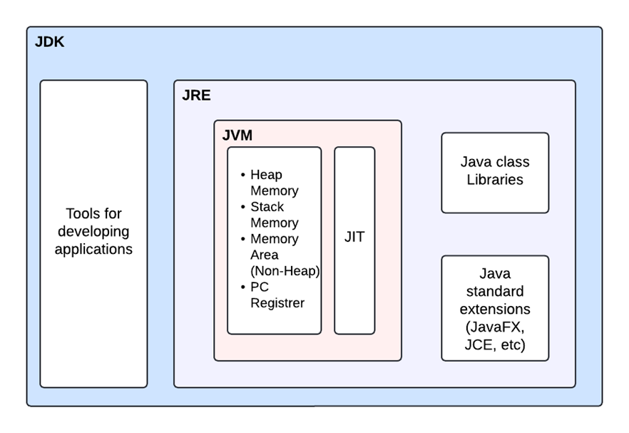
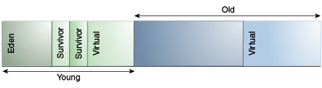

# Lecture Plan

1. Java Basics

---

### What is Java?

#### Java Features

- Highlevel
- Statically typed
- Strongly typed language
- Class based Object Oriented Programming Language
- platform agnostic (write once and run anywhere)

### JDK, JRE & JVM




**Java Development Kit:**

- JRE
- Java Compiler

**Java Runtime Environment:** 

components: 

- Java Libraries (pre written code)
- Java Class Loader (load into jvm)
- JVM

**Java Virtual Machine:** 

- bytecode to machine code
- interpreter
- JIT compiler

**Just in Time Compiler:**

- compiles Bytecode to Machine Code.
- JIT is enabeled by default
- For each method JVM maintains an Invocation count. When the count exeeds the threshold value the JIT is used to complie the method to improve the performance.

### JDK Installation

[open jdk Adoptium](https://adoptium.net/en-GB/)

1. unarchive the download
2. copy the path to bin
3. edit `path` in Enviromental Variables and add the JDK path.

### Eclipse Installation


[eclipse installation](https://www.eclipse.org/downloads/packages/)

### Comments

```java

// Single Line

/* Multi Liine

Comment

*/

```

### Primitives

- Numerical and boolean
- Stored in stack memory

#### Numerical
**Integral**

- byte-8b 
- short-16b
- int-32b
- long-64b
- char-16b unsigned UTF-16 

**Floating Point**

- float-32b 
- double-64b

#### Boolean

true or false

### Operators

- unary: +, -, ++, --, ! (postfix and prefix have the higher precidence)
- Arithmatic: +,-,*,/,% (multplication and division have the higher precidence)
- relational: == , !=, >, >=, <, and <=
- bitwise &, ^, | and ~
- shift : <<, >>, >>>
- logical or conditional: &&, ||
- terinary ?:
- assignment =, +=, -= *=, /=
- type comparision : `instanceof`

### Reference Types

- class
  - enum types 
- interface
- array types

**Object:** a bundle of state and behavior

**Class:**  blueprint or prototype from which objects are created


### The `Object` Class

- Object Class is the superclass of all other classes. All class and array types inherit the methods of class `Object`.

- clone: duplicate of an object
- equals: object equality based on value, not reference, comparision
- finalize: run just before the object is destroyed 
- getClass: returns the Class object


[reference](https://docs.oracle.com/javase/specs/jls/se7/html/jls-4.html)


### Java Memory Management

#### JVM Stack Memory

- static memory allocation and execution of threads
- created when a method is executed
- contains primitive values of a method and reference to objects that are in heap.
- stack frame of a method flushed after method execution
- grows and shrinks as methods are called and returned.
- when the memory is full it Java throws a `StackOverFlowError`

#### Heap Memory

- Dynamic memory allocation for objects and JRE classes at runtime.
- When Heap space if full Java throws `OutOfMemoryError`
- memory access is slower than stack
- Garbage collection deallocates the memory


### Java Garbage Collection

- Young Generation(eden + 2 survior) - minor collection
- Old Generation (tenured): Major collection



----

### Coding Activity

1. even & odd
2. swap two numbers
3. octa to hexa
4. hexa to octa

---

