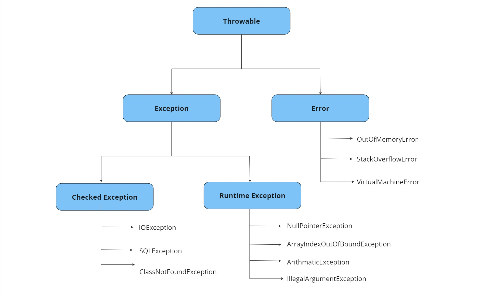

# Lecture/Guided Coding Example Plan

1. Exception Handiling

---

## Exception Handiling

**Exception:** an event, which occurs during the execution of a program, that disrupts the normal flow of the program.

**exception object:** info about the error + type and state of the program.

**Error:** jvm throws and error if a dynamic linking failure or any other hard failure occurs. errors are neither caught nor thrown by the programmers.

### Unchecked Exception

- RuntimeException classess and the Error classes.

### Checked Exception

- exceptions other than the unchecked exceptions and error classes.
- checked during the compile time.

### try, catch and finally

**try:** block of code in which an exception can occur.

**catch:** block of code that can handle a particular type of exception/exceptions.

**finally:** block of code that is gauranteed to execute. right place to close files and resources, (clean up code for the try block). 

### try with resources

- try statement that declares one or more resources. 
- ensures that resources declared are closed at the end of the statement.

**resource:** object that must be closed after the program is finised with it.

### throws

-  an exception can be specified using throws, if it is not necessary to catch the exception and its better to let a method furthur up the stack handle it.
-  throws clause is generally used for checked exceptions and its not necessary for the unchecked exception.

### custom exception and throw keyword

- The throw keyword is used to explicitly raise an exception.
- Custom exceptins can be created by extending the Exception class.

