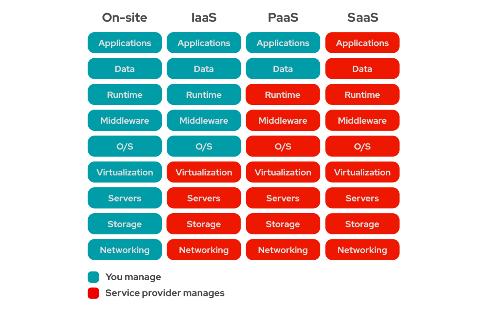

# Lecture/Guided Coding Example Plan

1. Cloud Computing Fundamentals
2. RDS

---

### Cloud Computing

**Service Types**
- IaaS
- PaaS 
- SaaS 

**Public Cloud**
- Cloud resources and services are hosted and managed by a third-party cloud provider (ex: Amazon Web Services (AWS), Microsoft Azure, Google Cloud Platform).
- Users access these resources over the internet on a pay-as-you-go or subscription basis.

**Private Cloud**
- A cloud computing environment hosted and managed within an organization's own data center.
- Provides more control and privacy but requires more resources and maintenance.

### AWS

**Budget Alerts**
- AWS provides budgeting tools to monitor and control costs.
- you can set custom budgets and receive alerts when your actual or forecasted costs exceed the budgeted amount.

#### IAM (Identity and Access Management)

**Users**
- an IAM user is an individual identity with specific permissions to access and manage AWS resources.
- each user has unique security credentials (access key ID and secret access key).

**User Groups**
- a collection of IAM users.
- permissions can be assigned to groups instead of individual users for easier management.

**Roles**
- an IAM role is an identity with specific permissions that can be assumed by AWS services.
- roles are used to grant temporary, limited privileges instead of creating and managing long-term credentials.

### RDS

- Relational Database service.
- Engine Type: MySQL, PostgreSQL, Oracle DB, Microsoft SQL Server, and Maria DB

**RDS Config:**

1. RDS Proxy: Database proxy for connection pooling, query optimization and caching.
2. Autoscaling: Vertical Auto Scaling with threshold value
3. Automated Backups: DB snapshots with retention period
4. Public Access: Yes- accessible ouside the VPC. No- can't be accessed outside the VPC.
5. RDS is associated with security groups. sgs control the inbound and outbound traffic.
6. RDS to EC2 connection can be established. RDS (private subnet) -- EC2 (Public Subnet) and Private RDS can be securedly accssed via ec2.

**DB Instance Class**

- memory optimised
- burtable t series

**Storage**

- gp3
- gp2
- iops
- magnetic

[Intance Types](https://aws.amazon.com/rds/instance-types/)

[RDS Pricing](https://aws.amazon.com/rds/pricing/)

**security**

- KMS for at rest security
- In flight encryption
- Security groups
- IAM roles