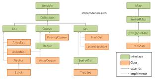

# Lecture/Guided Coding Example Plan

1. Time and Space Complexity (Big O notation)
2. Collections
3. Collection API
4. Algorithms
   1. Searching
   2. Sorting
   3. Greedy

---

## Generics

- Generics enable types (classes and interfaces) to be parameters when defining classes, interfaces and methods.

synatx 

```java
class name<T1,T2,...,Tn>{/*..*/}
```

naming convestions

1. E - element
2. K - Key
3. N - Number
4. T - Type
5. V - Value

## Asymptotic Notation


- Big O notation is used to describe the upper bound of an algorithm's time or space complexity.
- Big Omega is used to describe the lower bound.
- Theta is used to describe the average bound.


## Java Collection Framework





