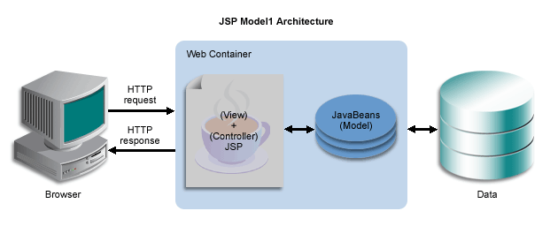
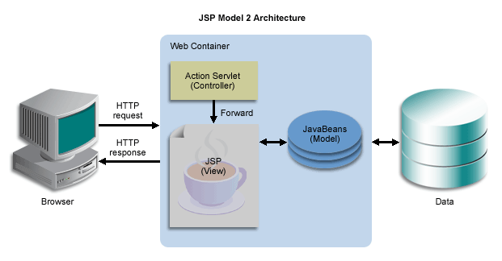

# Lecture/ Guided  coding example

1. JSP

---

# JSP

Java Server Pages

A JSP page is a text document that contains static data, which can be expressed in any text-based format (such as HTML, SVG, WML, and XML), and JSP elements, which construct dynamic content.
### Models 1 & 2

Model 1: the JSP page handles both the view (presentation) and the controller (request processing). The business logic is delegated to JavaBeans, which are instantiated and manipulated within the JSP page.

- suitable for simple applications
- leads to significant ammount of scriplets.



Model 2: JSP page is strictly used for the view (presentation), while the controller responsibilities are handled by a servlet. The servlet processes client requests, interacts with JavaBeans to perform business logic, and then forwards the request to a JSP page to generate the view.

- suitable for large or more complex applications


### Java Bean

A java class that follows certain conventions:

1. All properties are non static and private
2. A public no arg constructor
3. getters and setters
4. recomended to implements serializale


### Directives
- elements that relay messages to the JSP container and affect how it compiles the JSP page
- page(language, import statements and error pages), include(translation phase) and taglib (custom tags). 


### Scriplets

used to write the java code. any code in scrilets is added to the service method.
```jsp
<%

int i = 10;
%>
```

### Declerations

- used to declare varibales and methods that get inserted to the servlet class(outside the service method).

```jsp
<%! 

int i = 10;

void printSomething(){
    System.out.println("Hello");
}

%>
```

<i>refere code for Composing HTML documents in jsp and Storing Form Data</i>

### Implicit Objects

- predefined variables available in jsp

#### Request

- HTTP Request

#### Response

- HTTP Response

#### Out

- used to send content to client. uses jspWriter


