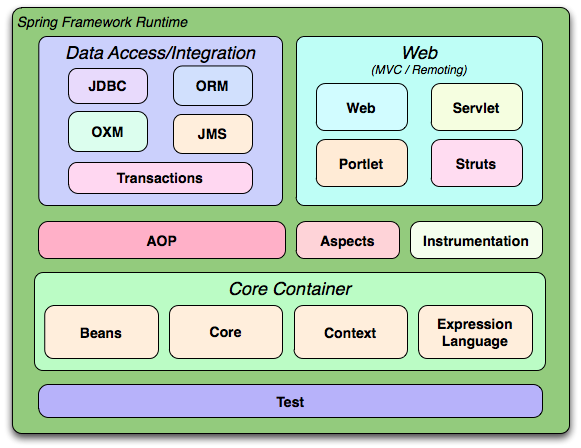

# Lecture/ Guided coding example

1. Spring core

---

## **Spring Framework**

### **What is Spring?**

Spring is a comprehensive framework for enterprise Java development. It provides a wide range of capabilities to simplify the development of Java applications, including:

- **Dependency Injection (DI):** Simplifies how dependencies between objects are managed.
- **Aspect-Oriented Programming (AOP):** Allows separation of cross-cutting concerns like logging and transactions.
- **Transaction Management:** Provides a consistent programming model for transaction management.
- **Data Access:** Simplifies database interactions using technologies such as JDBC and ORM frameworks.
- **Web Development:** Supports building web applications through Spring MVC and other components.

### **Advantages of Spring**

1. **Inversion of Control (IoC):**
   - **Flexibility:** Decouples application components and allows for easier testing and maintenance.
   - **Configuration Management:** Centralizes configuration and management of components.

2. **Dependency Injection (DI):**
   - **Loose Coupling:** Components are not dependent on their dependencies but rather on abstractions.
   - **Easier Testing:** Dependencies can be mocked or stubbed easily.

3. **Aspect-Oriented Programming (AOP):**
   - **Separation of Concerns:** Manages cross-cutting concerns such as logging, security, and transactions.
   - **Cleaner Code:** Keeps business logic separate from auxiliary concerns.

4. **Comprehensive Infrastructure Support:**
   - **Data Access:** Integrates with various data access technologies (JDBC, JPA, Hibernate).
   - **Transaction Management:** Provides declarative transaction management.
   - **Web Framework:** Includes support for REST, SOAP, and MVC.

5. **Modularity:**
   - **Component-Based Architecture:** Encourages modular design and reuse of components.

6. **Integration:**
   - **Support for Various Technologies:** Easily integrates with other frameworks and technologies, such as JMS, RabbitMQ, and more.




### Spring IOC container

IoC container manages the creation and lifecycle of beans.


### `ApplicationContext` vs. `BeanFactory`

- **`BeanFactory`:**
  - **Definition:** The simplest container providing basic DI functionality.
  - **Use Case:** Suitable for lightweight applications or when you need the most basic container functionality.
  - **Features:** Lazy initialization of beans, meaning beans are created only when needed.
  - **Limitations:** Does not support some advanced features like AOP, event propagation, and declarative transactions.

- **`ApplicationContext`:**
  - **Definition:** A more advanced container that builds on `BeanFactory` and provides additional features.
  - **Use Case:** Suitable for most applications due to its support for features like AOP, event handling, and internationalization.
  - **Features:** Eager initialization of beans (beans are created on startup), support for application events, AOP, and declarative transaction management.
  - **Types:** `ClassPathXmlApplicationContext`, `FileSystemXmlApplicationContext`, `AnnotationConfigApplicationContext`, etc.

**Summary:** While `BeanFactory` is suitable for basic scenarios, `ApplicationContext` provides a richer set of features and is typically used in modern Spring applications.

### **Spring Bean**

- **Definition:** A bean is an object that is instantiated, configured, and managed by the Spring IoC container.
- **Lifecycle:** Includes creation, initialization, and destruction phases.
- **Scopes:**
  - **Singleton:** One instance per Spring IoC container.
  - **Prototype:** A new instance is created each time a bean is requested.
  - **Request:** A new instance is created for each HTTP request (web applications).
  - **Session:** A new instance is created for each HTTP session (web applications).
  - **Websocket Session:** 	Scopes a single bean definition to the lifecycle of a WebSocket.

### **Dependency Injection (DI)**

- **Constructor Injection:** Dependencies are provided through the constructor.
- **Setter Injection:** Dependencies are provided through setter methods.
- **Field Injection:** Dependencies are injected directly into fields (less recommended due to reduced testability).

### **XML-Based Injection**

- **Configuration:** Define beans and their dependencies in an XML file.
- **Example:**
  ```xml
  <bean id="name" class="className">
      <property name="name" value="value"/>
      <constructor-arg ref="bean"/>
  </bean>
  ```

### **Java-Based Configuration**

- **Configuration Class:** Use `@Configuration` to define a configuration class.
- **Bean Definition:** Use `@Bean` annotation to define beans.
- **Example:**
  ```java
  @Configuration
  public class AppConfig {
      
      @Bean
      public Demo demo() {
        //code
      }
  }
  ```

**reference to official docs**

  [spring docs](https://docs.spring.io/spring-framework/reference/overview.html)

